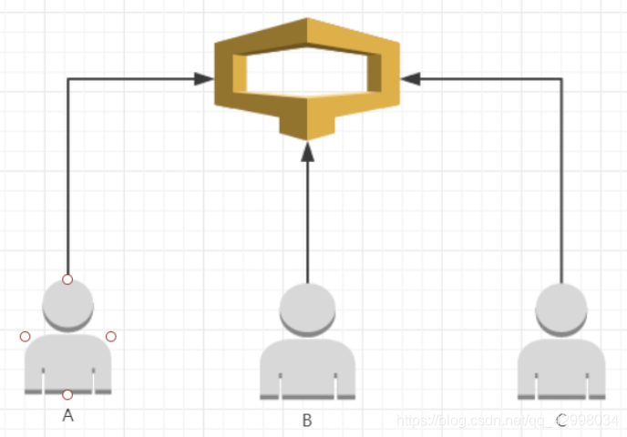

# 锁
## 什么是锁

锁在JAVA中是一个非常重要的概念，尤其是在当今的互联网时代，高并发的场景下，更是离不开锁。那么锁到底是什么呢？
在计算机科学中，锁(lock)或互斥(mutex)是一种同步机制，用于在有许多执行线程的环境中强制对资源的访问限制。
锁旨在强制实施互斥排他、并发控制策略。
咱举一个生活中的例子：大家都去过超市买东西，如果你随身带了包呢，要放到储物柜里。
咱们把这个例子再极端一下，假如柜子只有一个，现在同时来了3个人A，B，C，都要往这个柜子里放东西。
这个场景就构造了一个多线程，多线程自然离不开锁。如下图所示：


A，B，C都要往柜子里放东西，可是柜子只能放一件东西，那怎么办呢？这个时候呢就引出了锁的概念，3个人中谁抢到了柜子的锁，谁就可以使用这个柜子，其他的人只能等待。
比如：C抢到了锁，C可以使用这个柜子。A和B只能等待，等C使用完了，释放锁以后，A和B再争抢锁，谁抢到了，再继续使用柜子。
代码演示如下：

```java
// 创建柜子Cabinet类
public class Cabinet {
    // 柜子中存储的数字
    private int storeNumber;

    public int getStoreNumber() {
        return storeNumber;
    }

    public void setStoreNumber(int storeNumber) {
        this.storeNumber = storeNumber;
    }
}
```
```java
// 创建用户UserInfo类
public class UserInfo {
    // 柜子
    private Cabinet cabinet;
    // 存储的数字
    private int storeNumber;

    /**
     * @param cabinet 要使用的柜子
     * @param storeNumber 要存储的数字
     */
    public UserInfo(Cabinet cabinet, int storeNumber) {
        this.cabinet = cabinet;
        this.storeNumber = storeNumber;
    }
    // 使用柜子
    public void useCabinet() {
        cabinet.setStoreNumber(storeNumber);
    }

    // 启动类模拟3个用户使用柜子的场景：
    public static void main(String[] args) {
        final Cabinet cabinet = new Cabinet();
        ExecutorService es = Executors.newFixedThreadPool(3);
        for (int i = 0; i < 3; i++) {
            final int storeNumber = i;
            es.execute(() -> {
                UserInfo users = new UserInfo(cabinet, storeNumber);
                synchronized (cabinet) {
                    users.useCabinet();
                    System.out.println("我是用户" + storeNumber + ",我存储的数字是：" + cabinet.getStoreNumber());
                }
            });
        }
        es.shutdown();
    }
}
```

## 乐观锁 与 悲观锁

乐观锁与悲观锁应该是每个开发人员最先接触的两种锁。 但是不是在 JAVA 中接触的，而是在数据库当中。
当时的应用场景主要是
的时候，更新数据这个场景也是使用锁的非常主要的场景之一。
更新数据的主要流程如下：

## 分布式锁
### 多种分布式锁🔒的实现方案，如何选择？

| 方式        | 优点          | 缺点               |
|-----------|-------------|------------------|
| 数据库       | 实现简单，易于理解   | 对数据库压力大          |
| Redis     | 易于理解        | 自己实现，不支持阻塞       |
| Zookeeper | 支持阻塞        | 需理解zookeeper，程序复杂 |
| Curator   | 提供锁的方法，支持阻塞 | 依赖zookeeper，强一致  |
| Redisson  | 提供锁的方法，支持阻塞 |                  |

不推荐自己编写的分布式锁，推荐使用Redisson和Curator实现的分布式锁